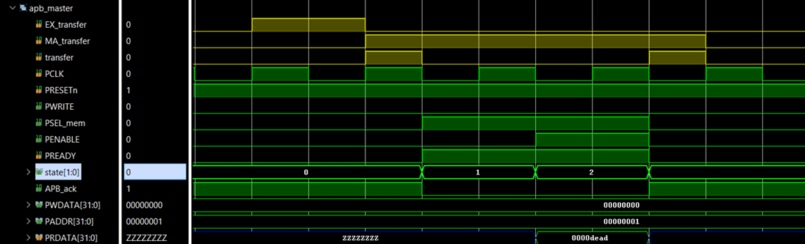

All state transitions occur on the **negative edge of the clock**, while address and data are latched on the **positive edge**, ensuring clean synchronization. 
Load and Store instructions automatically trigger APB transactions using an internal `transfer` signal, and the CPU is stalled until the peripheral asserts `PREADY`.

---

## Verified APB Transactions

The APB controller was verified through RTL simulations for all memory access patterns.

---

### 🔹 Single Read Transaction

- Address is latched in **SETUP**
- Read data is captured in **ACCESS**
- Transaction completes in **3 cycles**

---

### 🔹 Single Write Transaction

- Address and write data are latched in **SETUP**
- Write completes in **ACCESS**
- Transaction completes in **3 cycles**

---

### 🔹 Multiple Consecutive Reads

Back-to-back load instructions are pipelined using the `transfer` signal, avoiding unnecessary return to IDLE and improving throughput.

---

### 🔹 Multiple Consecutive Writes

Store instructions are also pipelined using repeated **SETUP → ACCESS** cycles for maximum bus utilization.

---

### 🔹 Read Followed by Write

Mixed memory operations execute correctly with:
- `PRDATA` latched for the read
- `PWDATA` latched for the write
- No protocol violation or data corruption

---

## 🏁 Results Summary

✔ Each APB transfer completes in **3 cycles**  
✔ Back-to-back transfers complete in **3 + 2n cycles**  
✔ Supports pipelined load/store operations  
✔ CPU is correctly stalled and resumed using `APB_ack`  
✔ Fully compliant with AMBA-APB timing and handshaking  

This APB implementation provides a **robust, low-latency, and resource-efficient bus** for all TinyRISC peripherals.
